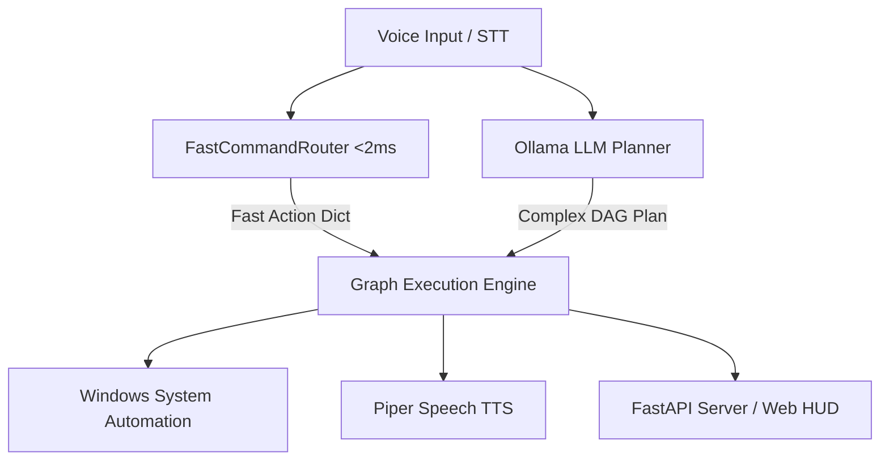

# JARVIS 3.0 — AI Operating System for Windows

<p align="center">
  
  <br>
  <b>An autonomous, voice-first AI Operating System built for seamless Windows desktop automation.</b>
  <br>
  <a href="docs/INSTALL.md"><b>Installation</b></a> •
  <a href="docs/ARCHITECTURE.md"><b>Architecture</b></a> •
  <a href="docs/API.md"><b>REST API</b></a> •
  <a href="docs/FAST_COMMANDS.md"><b>Fast Commands</b></a> •
  <a href="docs/TROUBLESHOOTING.md"><b>Troubleshooting</b></a>
</p>

---

## 🌟 Overview

JARVIS 3.0 is a modular, event-driven AI Operating System designed to automate Windows interactions through natural voice commands, LLM-driven planning, and instant sub-millisecond execution.

### Key Features
- **🎙️ Voice-First Architecture**: Always-on passive wake-word detection (`"I'm back"`, `"Hey Jarvis"`) transitioning smoothly to continuous active conversation mode.
- **⚡ FastCommandRouter**: Deterministic regex/keyword routing executing system actions (volume, application launch, media control, stats, dates, times) in $<2\text{ ms}$ bypassing LLM latency.
- **🧠 DAG Execution Engine**: Dynamic Directed Acyclic Graph runner capable of executing multi-step complex automation tasks with automatic fallback handling.
- **🖥️ Native Windows Automation**: Intelligent Start Menu & PATH app discovery, UI control, window manipulation, clipboard management, and system metrics.
- **🌐 Web HUD & REST API**: Modern web interface featuring a real-time audio visualizer and FastAPI endpoints for external integrations.

---

## 🏗️ Architecture



---

## 🚀 Quick Start (One Command)

### Windows
```cmd
git clone https://github.com/your-username/jarvis.git
cd jarvis
setup.bat
run.bat
```

### Linux / macOS
```bash
git clone https://github.com/your-username/jarvis.git
cd jarvis
chmod +x setup.sh
./setup.sh
./run.sh
```

---

## ⚙️ Configuration

Copy `.env.example` to `.env` to configure models, ports, and voice phrases:

```env
JARVIS_ENV=production
JARVIS_PORT=8000
JARVIS_CHAT_MODEL=qwen3.5:4b
JARVIS_WAKE_PHRASES=i'm back,hey jarvis,jarvis
```

---

## 🎙️ Common Voice Commands

- **Applications**: `"Open Chrome"`, `"Open Visual Studio Code"`, `"Open Terminal"`
- **System Control**: `"Volume up"`, `"Mute"`, `"Take screenshot"`, `"Show desktop"`, `"Lock PC"`
- **System Stats**: `"What is my CPU usage?"`, `"Check RAM and battery"`
- **Information**: `"What time is it?"`, `"What day is it?"`, `"Search the web for quantum computing"`

---

## 🧪 Testing & Verification

Run the comprehensive unit test suite:
```cmd
test.bat
```

---

## 📄 License

This project is licensed under the [MIT License](LICENSE).
