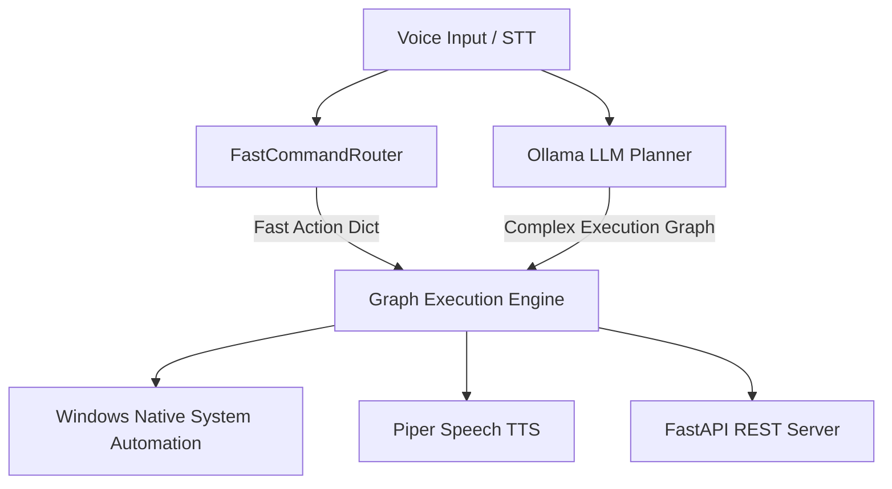

# JARVIS OS Architecture Documentation

## Overview

JARVIS OS is an autonomous voice-first AI operating system for Windows built around a modular **Dependency Injection Container**, an **In-Memory Event Bus**, and a **Directed Acyclic Graph (DAG) Execution Engine**.

## Layer Architecture

### 1. Presentation & Voice Layer (`src/jarvis/speech`, `voice_first.py`)
- **Speech-to-Text (STT)**: Dual `faster-whisper` models (`int8` quantized). `tiny` model handles passive wake-word detection (`"i'm back"`, `"hey jarvis"`); `base` model handles active command transcription.
- **Text-to-Speech (TTS)**: Piper neural TTS engine playing audio asynchronously through `sounddevice` with lock-protected playback queues.

### 2. Fast Routing & Planning Layer (`fast_command_router.py`, `src/jarvis/planner`)
- **FastCommandRouter**: $O(k)$ keyword pre-filter followed by regex pattern matching. Resolves volume, applications, dates, times, screenshots, and system statistics in sub-milliseconds without triggering LLM inference.
- **LLM Planner**: Ollama client integration (`qwen3.5:4b`) with automatic JSON extraction, circuit breakers, and aggressive repair fallbacks for complex multi-step reasoning.

### 3. Execution Engine (`src/jarvis/execution`)
- **GraphExecutionEngine**: Dynamic DAG runner evaluating dependency nodes (`TaskNode`) with fallback handling.
- **LegacyHandlerAdapter**: Bridge wrapping classic automation modules (app launching, keyboard/mouse automation, file operations, web browsing) as engine handlers.

### 4. Application Control & REST API (`src/jarvis/api`, `app.py`)
- **JarvisApplication**: Lifecycle orchestrator managing container registration (`ServiceContainer`) and event dispatching (`InMemoryEventBus`).
- **FastAPI REST Server**: Exposes API endpoints (`/api/command`, `/api/plan`, `/api/execute`, `/api/health`, `/api/voice/state`) for local frontend integration.
