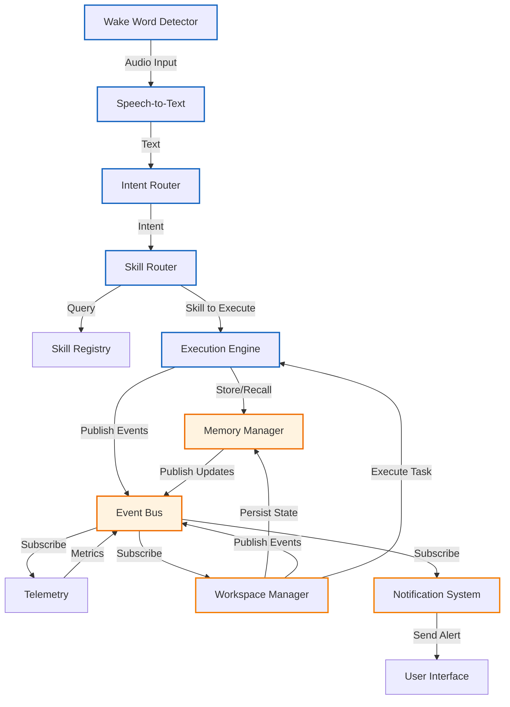

# Dependency Graph

## Dependency Summary

### Core Processing Pipeline (Synchronous)
1. **Wake Word Detector** → Speech-to-Text
2. **Speech-to-Text** → Intent Router  
3. **Intent Router** → Skill Router
4. **Skill Router** → Skill Registry
5. **Skill Router** → Execution Engine
6. **Execution Engine** → Memory Manager
7. **Execution Engine** → Event Bus
8. **Memory Manager** → Event Bus

### Workflow Processing (Mixed Sync/Async)
9. **Workspace Manager** → Memory Manager
10. **Workspace Manager** → Event Bus
11. **Workspace Manager** → Execution Engine
12. **Telemetry** → Event Bus (Subscription)
13. **Notification System** → Event Bus (Subscription)
14. **Notification System** → User Interface

### Key Properties
- **Acyclic**: No circular dependencies in direct call graph
- **Layered Architecture**: 
  - Core Pipeline (synchronous request/response)
  - Services (asynchronous event-driven)
  - Workflow Orchestration (business logic)
- **Single Responsibility**: Each node has clearly defined ownership
- **Event Bus as Central Mediator**: Enables loose coupling between components
- **Data Flow**: 
  - Synchronous: User Request → ... → Execution Engine → Memory/Event Bus
  - Asynchronous: Event Bus → Subscribers (Telemetry, Workspace, Notifications)

This dependency graph ensures:
1. No circular dependencies in direct method calls
2. Each subsystem has exactly one owner/responsibility
3. Communication follows the specified event-driven model where appropriate
4. Data persistence flows exclusively through Memory Manager
5. Cross-component communication happens via well-defined interfaces